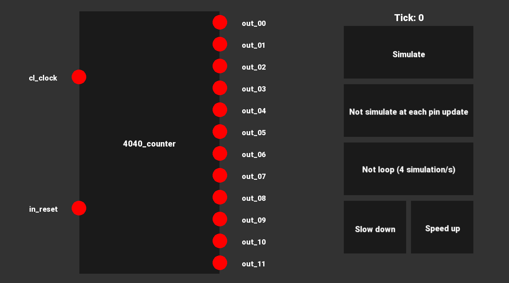
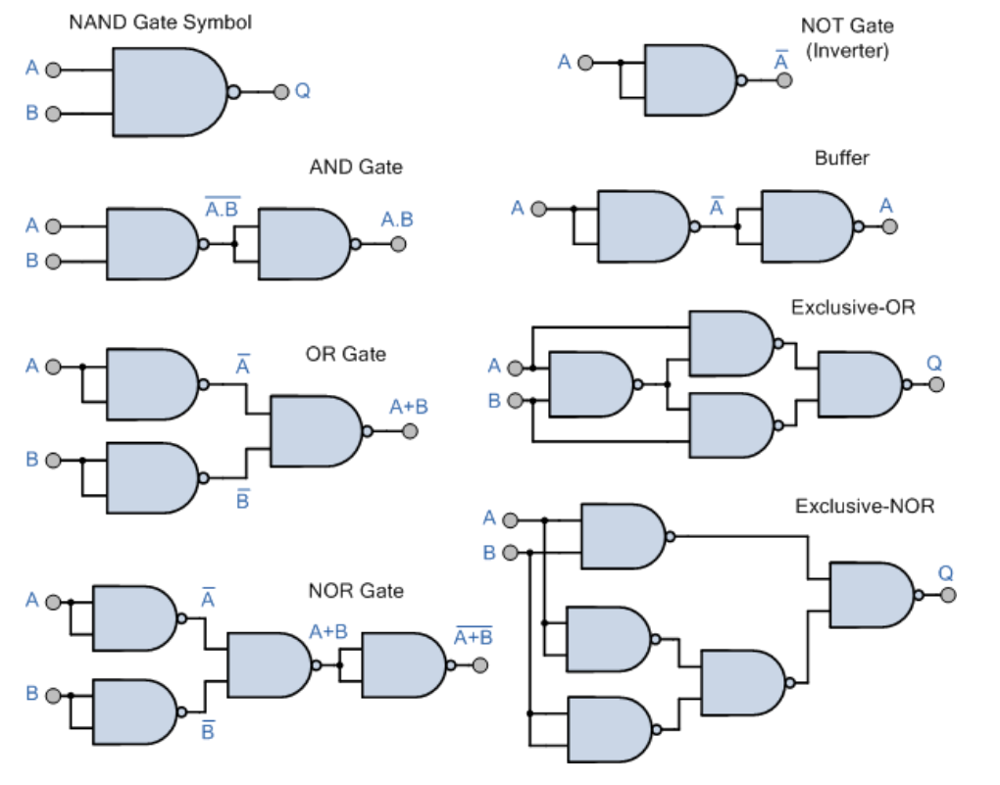

# NanoTekSpice

A simulator of logic gate circuits (Epitech tek2 C++ project)

## Build Cross Platform

### Configure

```bash
$ cmake .
```

### Build NanoTekSpice on Linux(GNU) / Windows(MSVC)

```bash
$ cmake --build .
```

### Unit tests on Linux(GNU) / Windows(MSVC)

```bash
$ cmake --build . --target tests_run
```

### Build Graphic NanoTekSpice (Bonus) on Linux(GNU)

/!\ Require SFML.

```bash
$ cmake --build . --target nanotekspice_graphic
```

## Shell

### Interactive Shell

A shell to interact with the circuit.

Usage:

```
$ ./nanotekspice -h
Usage: ./nanotekspice FILE.nts [INPUT_NAME=INPUT_VALUE]...

SHELL:
        exit:           closes the program.
        display/d:      prints the current tick and the value of all inputs and outputs in the standard output.
        input=value:    changes the value of an input. Possible value are 0, 1 and U. This also apply to clocks. Use *=value to change all inputs in same time.
        simulate/s:     simulate a tick of the circuit.
        loop/l:         continuously runs the simulation (simulate, display, simulate, ...) without displaying a prompt, until SIGINT is received.
        dump:           calls the dump method of every component.
        sd:             simulate and display.
```

Demo:

```
$ ./nanotekspice components/GateComponents/Gates/or.nts
> display
tick: 0
input(s):
  in_1: U
  in_2: U
output(s):
  out: U
> in_1=0
> in_2=0
> simulate
> display
tick: 1
input(s):
  in_1: 0
  in_2: 0
output(s):
  out: 0
> in_2=1
> s
> d
tick: 2
input(s):
  in_1: 0
  in_2: 1
output(s):
  out: 1
> exit
```

### Graphic Shell (Bonus)

A graphic shell to interact with the circuit.

Usage:
```
$ ./nanotekspice_graphic -h
Usage: ./nanotekspice [-g] FILE.nts [INPUT_NAME=INPUT_VALUE]...

OPTION:
        -g      run graphic shell, else run interactive shell in terminal

GRAPHIC_SHELL:
        LEFT_CLICK      enable an input and switch it from FALSE to TRUE and vice versa.
        RIGHT CLICK     disable an input (set it value as UNDEFINED).
        KEY_ESCAPE      close window.

SHELL:
[...]  same as nanotekspice
```

Demo:

```bash
$ ./nanotekspice_graphic -g examples/nts_single/4040_counter.nts
```



## Tristate

Tristate, an algebra with three states:

```r
UNDEFINED && UNDEFINED == UNDEFINED
FALSE && UNDEFINED == FALSE
TRUE && UNDEFINED == UNDEFINED
FALSE && TRUE == FALSE
TRUE && TRUE == TRUE

UNDEFINED || UNDEFINED == UNDEFINED
FALSE || UNDEFINED == UNDEFINED
TRUE || UNDEFINED == TRUE
FALSE || TRUE == TRUE
TRUE || TRUE == TRUE

UNDEFINED ^ UNDEFINED == UNDEFINED
FALSE ^ UNDEFINED == UNDEFINED
TRUE ^ UNDEFINED == UNDEFINED
FALSE ^ TRUE == TRUE
TRUE ^ TRUE == FALSE
```

## Components

All components, excepts IOComponents, are made up of nand gates only. For example, the 12-bits Binary Counter (4040) is made up of 405 nands shared in 514 sub components.



<!-- https://www.electronics-tutorials.ws -->

- IOComponents:
  - In:
    - input (hardcoded in CPP)
    - clock (value inverted after each ticks) (hardcoded in CPP)
    - true (always true) (hardcoded in CPP)
    - false (always false) (hardcoded in CPP)
  - Out:
    - output (hardcoded in CPP)
    - logger (write byte in log.bin or specified file) (hardcoded in CPP)
- GateComponents:
  - Gates:
    - UpgradedGates:
      - 3and (and gate with 3 inputs)
      - 3nand (nand gate with 3 inputs)
    - buffer
    - and
    - or
    - xor
    - not
    - nand (hardcoded in CPP)
    - nor
    - nxor
    - tristate (hardcoded in CPP)
  - 4001 (Four NOR logic gates)
  - 4011 (Four NAND logic gates)
  - 4030 (Four XOR logic gates)
  - 4069 (Six NOT logic gates)
  - 4071 (Four OR logic gates)
  - 4081 (Four AND logic gates)
- LogicComponents:
  - LogicUnits:
    - Adders:
      - adder (1 bit adder)
      - 4bits_adder (4 bits adder)
    - Decoders:
      - 2_to_4_decoder (2 to 4 lines single bit decoder)
      - 3_to_8_decoder (3 to 8 lines single bit decoder)
      - 4_to_16_decoder (4 to 16 lines single bit decoder)
    - FlipFlops:
      - D_SR_flipflop (D type SET-RESET (PRESET-CLEAR) flip flop)
      - D_R_flipflop (D type RESET (CLEAR) flip flop)
      - T_R_flipflop (T type RESET (CLEAR) flip flop)
    - Latches:
      - SR_latch (SET-RESET latch)
      - D_latch (D type latch)
    - Mux:
      - 2dmux (1 to 2 lines demultiplexer)
      - 2mux (2 to 1 line multiplexer)
      - 4mux (4 to 1 line multiplexer)
      - 8mux (8 to 1 line multiplexer)
    - Registers:
      - 4bits_register (4 bits register)
      - 8bits_register (8 bits register)
  - 4008 (4-bits Adder)
  - 4013 (Dual D-Type Flip-Flop)
  - 4017 (Johnson Decade Counter)
  - 4040 (12-bits Binary Counter) (hardcoded in CPP to increase performance in way to pass some speed tests)
  - 4040_gates (12-bits Binary Counter)
  - 4094 (8-bits Shift Register) (hardcoded in CPP)
  - 4512 (8 Channel Data Selector)
  - 4514 (4-bits Decoder)
  - 2716 (Read only memory of 16Kb (2048 sections of 8 bits) initialized for ./rom.bin by default) (hardcoded in CPP)
  - 4801 (Random access memory of 8Kb (1024 sections of 8 bits)) (hardcoded in CPP)

## Circuit

You can made your own nts circuit with all previous components and reuse it in an other circuit.

All components loaded by the NanoTekSpice are circuits located in `./components` folder.

Circuit format is (with XOR gate circuit as example):

```r
# filename: xor.nts or xor
# so the type of circuit is xor

# XOR logic gate

.chipsets:  # start chipset section (mandatory)
# format: type name

input in_1
input in_2
output out
nand gate_nand # a nand component titled gate_nand
or gate_or
and gate_and

.links: # start link section (mandatory)
# format: name_1:pinId_1 name_2:pinId_2
# order of link no matter as long as an input is connected to an output
# relation: N (in) to 1 (out)

in_1:1 gate_nand:1
in_2:1 gate_nand:2
in_1:1 gate_or:1
in_2:1 gate_or:2 # pin 1 of component named in_2 is linked to pin 2 of component named gate_or
gate_nand:3 gate_and:1
gate_or:3 gate_and:2
gate_and:3 out:1

.circuit: # start circuit section (optional, only if you want to reuse this circuit in an other)
# format: name (only input or output) pin
# set pin as input or output of the current component

in_1    1
in_2    2
out     3
```
